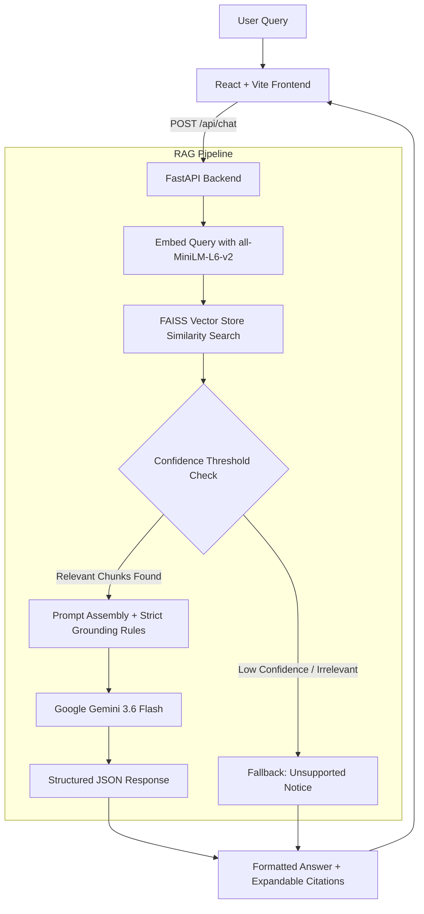

# 🤖 MLSC Knowledge Assistant

<div align="center">

  <p align="center">
    <strong>A production-ready Retrieval-Augmented Generation (RAG) assistant designed for the Microsoft Learn Student Community.</strong>
  </p>

  <p align="center">
    
    
    
    
    
    
    
  </p>
</div>

---

## 📖 Table of Contents
- [Overview](#-overview)
- [Key Features](#-key-features)
- [System Architecture](#-system-architecture)
- [RAG Workflow](#-rag-workflow)
- [Tech Stack](#-tech-stack)
- [Folder Structure](#-folder-structure)
- [Getting Started](#-getting-started)
  - [Prerequisites](#prerequisites)
  - [1. Backend Setup](#1-backend-setup)
  - [2. Frontend Setup](#2-frontend-setup)
- [Environment Variables](#-environment-variables)
- [API Reference](#-api-reference)
- [Evaluation & Benchmarking](#-evaluation--benchmarking)
- [Technical Highlights](#-technical-highlights)

---

## 🌟 Overview

The **MLSC Knowledge Assistant** is an intelligent full-stack conversational system built to answer questions regarding the **Microsoft Learn Student Community (MLSC)**. Grounded exclusively on verified club documentation (domains, leadership, membership guidelines, hackathons, and conduct rules), the assistant delivers fast, accurate, and fully cited answers while strictly preventing hallucinations.

---

## ✨ Key Features

- **Strict Grounding & Hallucination Prevention:** The LLM is governed by rigorous system prompts and a vector similarity confidence threshold to ensure answers come solely from retrieved knowledge.
- **Transparent Source Attribution:** Every generated answer cites the exact source files and chunk IDs used.
- **Fast Local Embeddings:** Utilizes `sentence-transformers/all-MiniLM-L6-v2` locally via HuggingFace for rapid, zero-cost semantic indexing.
- **In-Memory FAISS Vector Store:** Millisecond-level retrieval without requiring external vector database infrastructure.
- **Modern Responsive Chat UI:** Built with React 19, Tailwind CSS, Lucide icons, and real-time citation inspection drawers.
- **Automated Evaluation Pipeline:** Evaluation scripts utilizing Ragas and manual retrieval benchmarks to track precision, recall, and unsupported query detection rates.

---

## 🏗️ System Architecture



---

## 🔄 RAG Workflow

1. **Ingestion & Chunking:**
   - Raw text files from `mlsc_knowledge_base/` are chunked using `RecursiveCharacterTextSplitter` with a 500-character chunk size and 50-character overlap.
   - Chunks are embedded locally into a 384-dimensional dense vector space using `sentence-transformers/all-MiniLM-L6-v2`.
   - Embeddings are indexed and persisted via **FAISS**.

2. **Retrieval & Filtering:**
   - User questions are embedded and matched against top-$k$ nearest neighbors in FAISS.
   - Similarity scores are passed through a confidence threshold to discard out-of-domain queries before prompting the LLM.

3. **Synthesis & Citation:**
   - Top relevant contexts are formatted with their respective document metadata.
   - **Google Gemini 3.6 Flash** synthesizes a concise, structured response returned strictly as JSON with explicit citations.

---

## 💻 Tech Stack

### **Frontend**
- **Framework:** React 19 (TypeScript)
- **Build Tool:** Vite
- **Styling:** Tailwind CSS + PostCSS
- **Icons:** Lucide React
- **HTTP Client:** Axios

### **Backend & AI Pipeline**
- **Server:** FastAPI + Uvicorn
- **Orchestration:** LangChain (`langchain-core`, `langchain-community`, `langchain-text-splitters`)
- **LLM Provider:** Google Gemini via `langchain-google-genai`
- **Embeddings:** `langchain-huggingface` (`sentence-transformers/all-MiniLM-L6-v2`)
- **Vector Database:** FAISS CPU
- **Configuration & Validation:** Pydantic v2 + `pydantic-settings`
- **Evaluation:** RAGAS framework + custom benchmarking heuristics

---

## 📂 Folder Structure

```text
mlsc-knowledge-assistant/
├── backend/
│   ├── app/
│   │   ├── api/
│   │   │   └── endpoints.py         # FastAPI router (/api/chat, /api/health)
│   │   ├── models/
│   │   │   └── schema.py            # Pydantic schemas (Query, Response, Source)
│   │   ├── rag/
│   │   │   ├── embeddings.py        # HuggingFace & FAISS index management
│   │   │   ├── generator.py         # Gemini prompt & JSON response handler
│   │   │   ├── ingestion.py         # Document loader & recursive chunker
│   │   │   ├── pipeline.py          # Unified RAG execution pipeline
│   │   │   └── retriever.py         # Semantic search & score filtering
│   │   ├── config.py                # App configuration & dotenv loading
│   │   └── main.py                  # FastAPI application entrypoint
│   ├── evaluation/
│   │   ├── dataset.json             # Ground-truth evaluation dataset
│   │   └── run_evaluation.py        # Ragas & precision/recall test script
│   ├── .env.example                 # Example environment variables
│   └── requirements.txt             # Python dependencies
├── frontend/
│   ├── src/
│   │   ├── App.tsx                  # Main chat interface with sidebar & citations
│   │   ├── index.css                # Tailwind CSS base and custom scrollbar
│   │   └── main.tsx                 # React application entrypoint
│   ├── index.html                   # HTML template with Inter typography
│   ├── package.json                 # Frontend dependencies
│   ├── postcss.config.js            # PostCSS configuration
│   ├── tailwind.config.js           # Tailwind theme configuration
│   └── vite.config.ts               # Vite bundler configuration
├── mlsc_knowledge_base/             # Knowledge repository (single source of truth)
│   ├── about_mlsc.txt
│   ├── code_of_conduct.txt
│   ├── domains.txt
│   ├── hackathons.txt
│   ├── leadership.txt
│   └── membership.txt
├── TECHNICAL_DECISIONS.md           # Architecture and design rationale
├── .gitignore                       # Global git exclusion rules
└── README.md                        # Documentation
```

---

## 🚀 Getting Started

### Prerequisites
- **Python 3.10+**
- **Node.js 18+** & `npm`
- **Google Gemini API Key** (from [Google AI Studio](https://aistudio.google.com/app/apikey))

---

### 1. Backend Setup

```bash
# 1. Navigate to the backend directory
cd backend

# 2. Create and activate a Python virtual environment
# On Windows:
python -m venv venv
venv\Scripts\activate

# On macOS/Linux:
python3 -m venv venv
source venv/bin/activate

# 3. Install dependencies
pip install -r requirements.txt

# 4. Configure environment variables
# Copy .env.example to .env and insert your API key
copy .env.example .env     # (Windows)
# cp .env.example .env     # (macOS/Linux)

# 5. Start the FastAPI development server
venv\Scripts\uvicorn app.main:app --reload
```
The backend will be running at `http://127.0.0.1:8000`.

---

### 2. Frontend Setup

In a new terminal window:

```bash
# 1. Navigate to the frontend directory
cd frontend

# 2. Install Node dependencies
npm install

# 3. Start the Vite dev server
npm run dev
```

Open your browser and navigate to **`http://localhost:5173`** to access the application.

---

## 🔐 Environment Variables

Create a `.env` file in the `backend/` directory with the following variables:

| Variable | Description | Default |
|---|---|---|
| `GOOGLE_API_KEY` | Your Google Gemini API Key | *(Required)* |
| `FRONTEND_URL` | Allowed frontend origin for CORS | `http://localhost:5173` |
| `VECTOR_STORE_PATH` | Path to store/load FAISS index | `./faiss_index` |
| `KNOWLEDGE_BASE_PATH`| Path to raw source text documents | `../mlsc_knowledge_base` |
| `CONFIDENCE_THRESHOLD` | Minimum similarity threshold | `0.5` |

---

## 📡 API Reference

### `POST /api/chat`
Ask a question to the assistant.

**Request Body:**
```json
{
  "question": "What technical domains exist in MLSC?"
}
```

**Response Body:**
```json
{
  "answer": "MLSC features several technical domains including Web Development, Mobile Development, AI / Machine Learning, Cloud & DevOps, and Cybersecurity...",
  "sources": [
    {
      "document": "domains.txt",
      "chunk_id": "domains.txt_chunk_0"
    }
  ],
  "grounded": true,
  "retrieval": {
    "query": "What technical domains exist in MLSC?",
    "chunks": [ ... ]
  }
}
```

### `GET /api/health`
Health check endpoint verifying vector store and service status.

---

## 📊 Evaluation & Benchmarking

The assistant includes an evaluation dataset and automated runner:

```bash
cd backend
python evaluation/run_evaluation.py
```

This generates `evaluation_results.json` measuring:
- **Retrieval Success Rate:** Percentage of supported questions that successfully retrieved all expected ground-truth sources.
- **Unsupported Detection Rate:** System accuracy at rejecting out-of-domain / ungrounded questions.
- **RAGAS Metrics:** Context Precision, Context Recall, Faithfulness, and Answer Relevancy.

---

## 🧠 Technical Highlights

- **Lightweight Local Embeddings:** MiniLM computes embeddings entirely on the host machine without network latency or external rate limits.
- **Confidence Threshold Guardrails:** Prevents poor-matching context from polluting the generation prompt.
- **Strict Fallback Guarantee:** If a user asks about topics not in the documentation (e.g. *"What is the salary of a domain lead?"*), the assistant gracefully admits it doesn't have that information rather than hallucinating.
